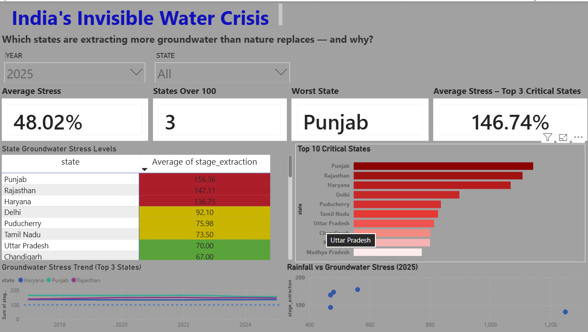
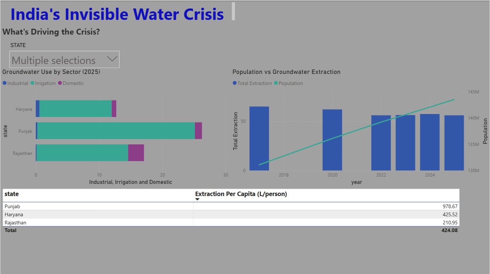
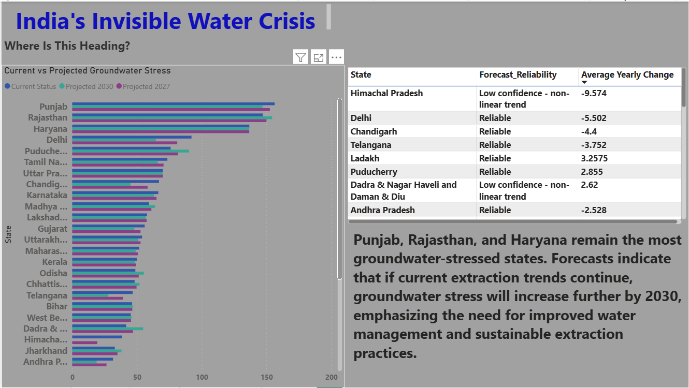

# India-groundwater-crisis-analysis
End-to-end groundwater depletion analysis for India using Python, PostgreSQL, Excel and Power BI — covering 36 states and UTs from 2017 to 2025
# India's Invisible Water Crisis

End-to-end groundwater depletion analysis for India using Python, PostgreSQL, Excel and Power BI — covering all 36 States and Union Territories from 2017 to 2025.

> **Key Finding:** Punjab (156%), Rajasthan (147%), and Haryana (137%) consistently extract groundwater beyond their annual recharge capacity despite receiving moderate-to-normal rainfall. The analysis indicates that India's groundwater crisis is primarily **extraction-driven rather than drought-driven**.

---

# Project Overview

Groundwater is India's most important freshwater resource, supporting agriculture, industries, and domestic consumption. This project investigates groundwater depletion across all 36 States and Union Territories using official government datasets from the Central Ground Water Board (CGWB), India Meteorological Department (IMD), and Census/ORGI.

The objective is to identify states experiencing unsustainable groundwater extraction, determine whether rainfall or excessive withdrawal is the primary driver, and forecast future groundwater stress.

The complete workflow includes data cleaning in Python, database analysis using PostgreSQL, forecasting in Excel, and interactive dashboard development in Power BI.

---

# Tech Stack

| Tool | Purpose |
|------|---------|
| Python (Pandas, NumPy) | Data Cleaning & Pre-processing |
| PostgreSQL | Database Design & SQL Analysis |
| Excel | Forecast Model |
| Power BI | Interactive Dashboard |
| Git & GitHub | Version Control |

---

# Dashboard Preview

## Overview Dashboard



## Drivers Dashboard



## Forecast Dashboard



---

# Key Findings

### 1. Over-Exploited States

Punjab (156%), Rajasthan (147%) and Haryana (137%) consistently exceed sustainable groundwater extraction limits and remain India's most groundwater-stressed states throughout the assessment period.

### 2. Agriculture is the Primary Driver

More than **80% of groundwater extraction** in the critical states is used for irrigation, while industrial and domestic consumption contribute comparatively little.

### 3. Rainfall is Not the Main Cause

The scatter analysis demonstrates that highly stressed states do not consistently receive the least rainfall. Punjab and Haryana receive moderate monsoon rainfall yet continue to experience severe groundwater depletion, indicating that excessive extraction is the dominant factor.

### 4. Forecast to 2030

Linear trend analysis suggests that if present extraction patterns continue, Rajasthan is projected to overtake Punjab as India's most groundwater-stressed state by 2030.

---

# Project Workflow

```text
Government Data Sources
(CGWB • IMD • Census)
            │
            ▼
Python Data Cleaning
            │
            ▼
PostgreSQL Database
            │
            ▼
SQL Analysis
            │
            ▼
Excel Forecast Model
            │
            ▼
Power BI Dashboard
            │
            ▼
Insights & Recommendations
```

---

# SQL Highlights

```sql
-- Depletion trend using Window Functions

SELECT
    state,
    year,
    stage_extraction,

    LAG(stage_extraction)
    OVER(PARTITION BY state ORDER BY year)
        AS previous_value,

    RANK()
    OVER(PARTITION BY year
         ORDER BY stage_extraction DESC)
        AS national_stress_rank

FROM groundwater

ORDER BY state, year;
```

Additional SQL queries are available in:

```
sql/analysis_queries.sql
```

---

# Repository Structure

```
india-groundwater-crisis-analysis/

│
├── dashboard/
│   ├── water_crisis_dashboard.pbix
│   ├── overview.png
│   ├── drivers.png
│   └── forecast.png
│
├── data/
│   ├── raw/
│   └── cleaned/
│
├── docs/
│
├── scripts/
│
├── sql/
│
├── README.md
│
└── .gitignore
```

---

# How to Reproduce

1. Clone this repository

```bash
git clone https://github.com/amritanshsingh98-dot/india-groundwater-crisis-analysis.git
```

2. Download the original datasets from the links provided in:

```
data/raw/README_sources.md
```

3. Run the Python cleaning script.

```bash
python scripts/clean_groundwater_data.py
```

4. Execute

```
sql/schema.sql
```

inside PostgreSQL.

5. Import the cleaned CSV files.

6. Execute

```
sql/analysis_queries.sql
```

7. Open

```
dashboard/water_crisis_dashboard.pbix
```

using Microsoft Power BI Desktop.

---

# Data Sources

- Central Ground Water Board (CGWB)
- India Meteorological Department (IMD)
- Census of India
- Office of the Registrar General of India (ORGI)

---

# Skills Demonstrated

- Data Cleaning
- Exploratory Data Analysis
- SQL Window Functions
- Database Design
- Forecast Modelling
- Power BI Dashboard Design
- Data Storytelling
- Data Visualization
- Python
- PostgreSQL
- Excel
- Git & GitHub

---

# Limitations & Data Notes

- CGWB groundwater assessments contain gaps for some intermediate years because assessments were conducted periodically before annual reporting.
- Population values are projections derived from Census data rather than measured yearly observations.
- Rainfall data is mapped from IMD meteorological subdivisions to states; some smaller Union Territories lack dedicated subdivisions.
- Forecasts use linear trend analysis and should be interpreted as indicative rather than absolute predictions.
- Some states with irregular historical patterns have lower forecast confidence.

---

# Future Improvements

- District-level groundwater analysis.
- Integration of remote sensing datasets (GRACE satellite observations).
- Machine Learning forecasting models (ARIMA, Prophet, LSTM).
- Web-based interactive dashboard deployment.
- Automated ETL pipeline for annual updates.

---

# Author

**Amritansh Singh**

Data Analytics | SQL | Python | Power BI | Excel

**GitHub:**  
https://github.com/amritanshsingh98-dot

**LinkedIn:**  
www.linkedin.com/in/amritansh-singh-a4017722a
---

## Project Objective

This project demonstrates an end-to-end data analytics workflow—from raw government datasets to actionable insights—using industry-standard tools and best practices in data engineering, analytics, visualization, and storytelling.
